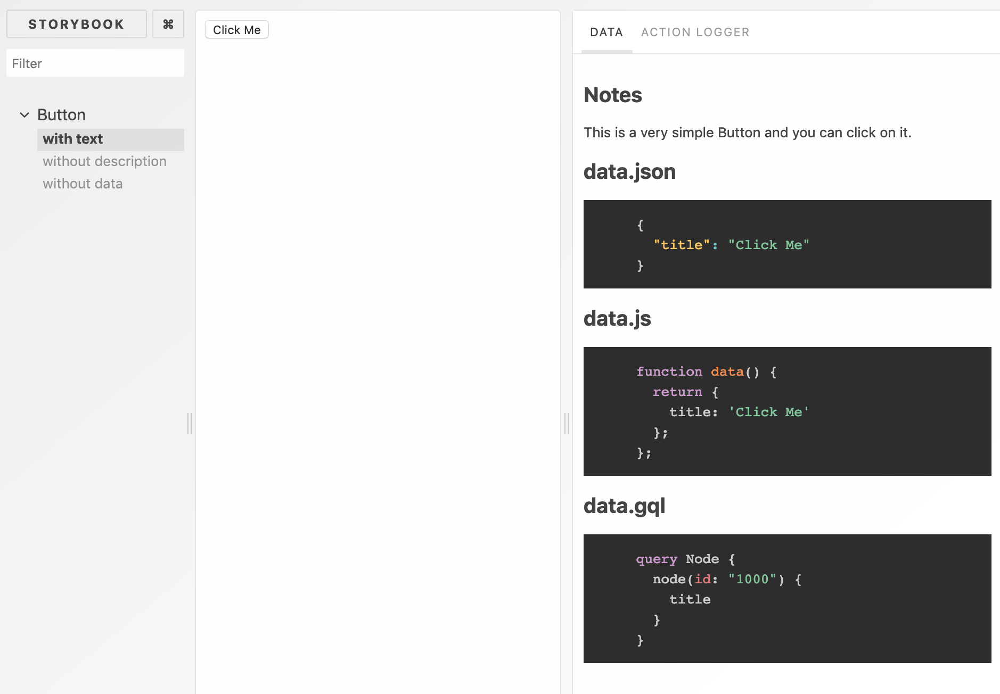

# storybook-addon-data

[](https://badge.fury.io/js/storybook-addon-data)
[](https://travis-ci.com/natterstefan/storybook-addon-data)
[](https://github.com/natterstefan/storybook-addon-data/blob/master/LICENCE)
[](http://makeapullrequest.com)

Present a component's properties in Storybook@5.

## Getting started

```bash
npm i storybook-addon-data --save
```

Then install the required peerDependency packages, which are listed by the
command:

```bash
npm info "storybook-addon-data@latest" peerDependencies
```

If using npm 5+, use this shortcut:

```bash
npx install-peerdeps --dev storybook-addon-data

# or
yarn add storybook-addon-data -D --peer
```

## Basic Usage

```js
// .storybook/addons.js
import 'storybook-addon-data/register'
```

```js
// index.stories.js
import React from 'react'
import { storiesOf } from '@storybook/react'
import { action } from '@storybook/addon-actions'
import withData from 'storybook-addon-data'

import README from './README.md'
import README_JSON from './README_JSON.md'

import dataJs from './data'
import dataJson from './data.json'
import dataYaml from './data.yaml'
import dataGql from './data.gql'

import Card from '.'

storiesOf('Button', module)
  .addDecorator(
    withData([
      // list of available types: https://github.com/conorhastings/react-syntax-highlighter/blob/HEAD/AVAILABLE_LANGUAGES_PRISM.MD
      { name: 'data.json', type: 'json', data: dataJson, notes: README_JSON },
      { name: 'data.js', type: 'javascript', data: dataJs },
      // requires `graphql-tag/loader` or a similar webpack loader
      { name: 'data.gql', type: 'graphql', data: dataGql },
      // requires `raw-loader` or a similar webpack loader
      { name: 'data.yaml', type: 'yaml', data: dataYaml },
    ]),
  )
  .add(
    'with text',
    () => <Button {...dataJson} onClick={action('clicked')} />,
    {
      // storybook-addon-data supports markdown here as well
      notes: README,
      // or
      // notes: 'This is a very simple Button and you can click on it.',
    },
  )
  .add('without description', () => (
    <Button {...dataJson} onClick={action('clicked')} />
  ))
```

And the `data.json` looks like this:

```json
{
  "title": "Click Me"
}
```

The result will look similar to:



Please note, that [`graphql-tag/loader`](https://github.com/apollographql/graphql-tag#webpack-preprocessing-with-graphql-tagloader)
(or another webpack loader) is required to make `.gql` files work in
storybook. Also [`raw-loader`](https://webpack.js.org/loaders/raw-loader/) is
required for `.yaml` files.

Take a closer look at the [example`s webpack.config.js](./packages/example-app/.storybook/webpack.config.js)
for more details.

## Available Methods

### withData

The `withData` [story decorator](https://storybook.js.org/docs/addons/introduction/)
accepts an object-array as the first and only argument. Each object must look
similar to like this:

```js
  {
    // or any other supported language (required)
    type: 'json',
    // the code to show in the addon panel (required)
    data: dataJson,
    // title above the code-block (optional)
    name: 'data.json',
    // will be rendered above the code block (optional, supports markdown)
    notes: README_JSON
  }
```

### withDataHOC

`withDataHOC` (previously called `withDataWrapper` accepts the same object-array
as `withData` does. The only difference is, that each `data` provided in any of
the objects can be made available to the rendered component of the story.

This will look similar to:

```js
storiesOf('Button', module).add(
  'with withData HoC',
  withDataWrapper(
    [
      // `prop` makes the `data` available on `props.json` in the story
      { name: 'data.json', type: 'json', data: dataJson, prop: 'json' },
      // also this `data` value is availabe as `props.js` in the story
      { name: 'data.js', type: 'javascript', data: dataJs, prop: 'js' },
      // no `prop` => not available on props
      { name: 'data.gql', type: 'graphql', data: dataGql },
    ],
    // props = { json: {...}, js: {...} }
    props => <Button {...props.json} js={props.js} onClick={onClick} />,
  ),
)
```

## Supported Languages

The following languages are supported: [prism languages](https://github.com/conorhastings/react-syntax-highlighter/blob/HEAD/AVAILABLE_LANGUAGES_PRISM.MD).

## Available Syntax Highlighting Styles

As of now, the style is hard coded to `dracula`. This might change in one of the
future updates.

A list of available styles can be found [here](https://github.com/conorhastings/react-syntax-highlighter/blob/HEAD/AVAILABLE_STYLES_PRISM.MD).

## Development - Getting started

Use `yarn` instead of `npm`, because we rely on [`yarn`'s `workspaces` feature](https://yarnpkg.com/lang/en/docs/workspaces/).

```bash
yarn # will invoke yarn bootstrap afterwards automatically
yarn start # starts storybook (http://localhost:9001)
yarn watch # builds the addon with every change, but a browser request is still required
```

This is how one can add new dependencies to one of the [packages](./packages):

```bash
npx lerna add raw-loader --scope storybook-addon-data
```

## Publish

```bash
# prepare changelog, then exec
git commit -m "prepare release x.y.z"
git push
# now increase the versions with lerna
yarn publish # invokes lerna publish
```

## Licence

[Apache 2.0](LICENCE)

## Maintainers

<table>
  <tbody>
    <tr>
      <td align="center">
        <a href="https://github.com/natterstefan">
          
          </br>
          Stefan Natter
        </a>
        <div>
          <a href="https://twitter.com/natterstefan">
            
          </a>
        </div>
      </td>
    </tr>
  <tbody>
</table>
