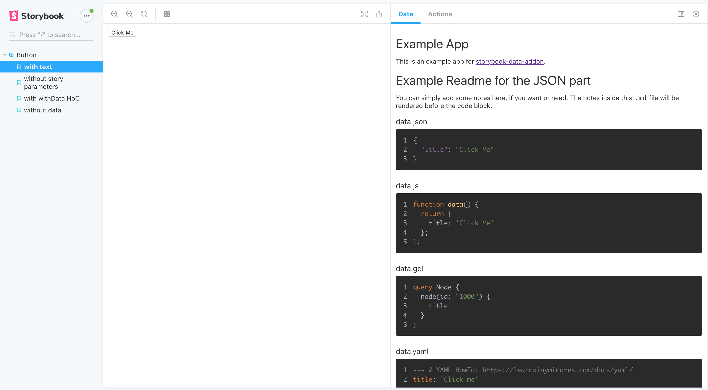

# storybook-addon-data

[](https://badge.fury.io/js/storybook-addon-data)
[](https://github.com/natterstefan/storybook-addon-data/blob/master/package.json)
[](https://snyk.io/test/github/natterstefan/storybook-addon-data)
[](https://github.com/natterstefan/storybook-addon-data/blob/master/LICENCE)
[](http://makeapullrequest.com)

Present a component's properties in Storybook@5.

## Getting started

```bash
npm i storybook-addon-data --save
```

Then install the required peerDependency packages, which are listed by the
command:

```bash
npm info "storybook-addon-data@latest" peerDependencies
```

If using npm 5+, use this shortcut:

```bash
npx install-peerdeps --dev storybook-addon-data

# or
yarn add storybook-addon-data -D --peer
```

## Basic Usage

```js
// .storybook/addons.js
import 'storybook-addon-data/register'
```

```js
// index.stories.js
import React from 'react'
import { storiesOf } from '@storybook/react'
import { action } from '@storybook/addon-actions'
import withData from 'storybook-addon-data'

import dataJson from './data.json'

import Card from '.'

storiesOf('Button', module)
  .addDecorator(
    withData([
      // also supported: javascript and graphql
      { name: 'data.json', type: 'json', data: dataJson },
    ]),
  )
  .add(
    'with text',
    () => <Button {...dataJson} onClick={action('clicked')} />,
    {
      notes: 'This is a very simple Button and you can click on it.',
    },
  )
  .add('without description', () => (
    <Button {...dataJson} onClick={action('clicked')} />
  ))
```

And the `data.json`:

```json
{
  "title": "Click Me"
}
```

The result will look similar to (Note: in the example I used also a `.js` and
`.gql` file):



## Advanced Usage

It is further possible to make the data in the Data panel available to the
component (eg. `<Button />`) with `withDataWrapper`. This will look similar to:

```js
storiesOf('Button', module).add(
  'with withData HoC',
  withDataWrapper(
    [
      // available on props.json
      { name: 'data.json', type: 'json', data: dataJson, prop: 'json' },
      { name: 'data.js', type: 'javascript', data: dataJs, prop: 'js' },
      // no prop => not available on props
      { name: 'data.gql', type: 'graphql', data: dataGql },
    ],
    props => <Button {...props.json} js={props.js} onClick={onClick} />,
  ),
  // story parameters
  {
    notes:
      'withDataWrapper: This is a very simple Button and you can click on it.',
  },
)
```

## Available Language Imports

The following languages are supported: [prism languages](https://github.com/conorhastings/react-syntax-highlighter/blob/HEAD/AVAILABLE_LANGUAGES_PRISM.MD).

## Development - Getting started

Use `yarn` instead of `npm`, because we rely on [`yarn`'s `workspaces` feature](https://yarnpkg.com/lang/en/docs/workspaces/).

```bash
yarn # will invoke yarn bootstrap afterwards automatically
yarn start # starts storybook (http://localhost:9001)
yarn watch # builds the addon with every change
```

Add new dependencies to one of the packages with eg.:

```bash
npx lerna add raw-loader --scope storybook-addon-data
```

## Publish

```bash
# prepare changelog, then exec
git commit -m "prepare release x.y.z"
git push
# now increase the versions with lerna
yarn publish # invokes lerna publish
```

## Licence

[Apache 2.0](LICENCE)

## Maintainers

<table>
  <tbody>
    <tr>
      <td align="center">
        <a href="https://github.com/natterstefan">
          
          </br>
          Stefan Natter
        </a>
        <div>
          <a href="https://twitter.com/natterstefan">
            
          </a>
        </div>
      </td>
    </tr>
  <tbody>
</table>
